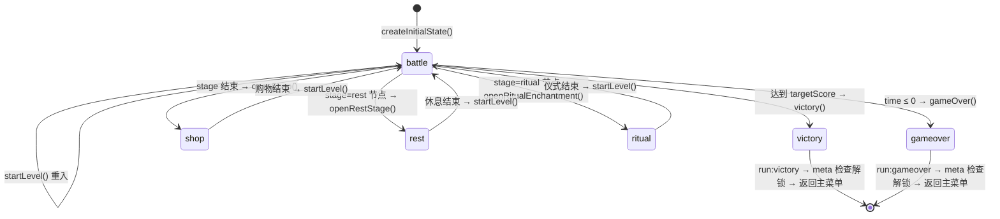
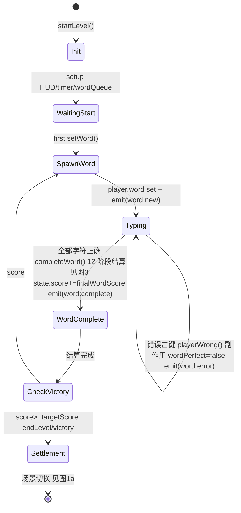
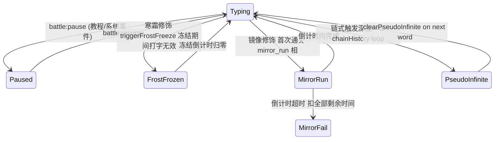

# 图 1 — 战斗生命周期状态机

> 📍 **行号基线**：`file.ts:N` 基于 git commit `1b07c96`（2026-04-13）。

**意图**：打字肉鸽存在两套并存的 phase 概念：顶层 `state.phase: GamePhase` 描述玩家在什么**场景**（战斗/商店/休息/仪式/胜利/失败），`BattleState.phase: BattlePhase` 描述战斗内部的**子状态**（准备/进行中/暂停/胜利/失败）。本图解释两套如何协作，以及战斗内部事件如何触发子状态转换。Godot 端应把前者实现为 `SceneManager.switch()`，后者作为 `Battle.cs` 内部 FSM。

---

## 两套 Phase 速查

| Phase 类型 | 类型定义 | 持有者 | 值域 |
|---|---|---|---|
| `GamePhase` | `src/src/core/types.ts:178` | `state` 单例 (`state.phase`) | `'battle' \| 'shop' \| 'gameover' \| 'victory' \| 'ritual' \| 'rest'` (6) |
| `BattlePhase` | `src/src/core/state/BattleState.ts:9` | `BattleState` OOP 类 (`battleState.phase`) | `'ready' \| 'playing' \| 'paused' \| 'victory' \| 'defeat'` (5) |

**注意**：两套 phase 的 `'victory'` 不是同一个东西。`GamePhase.victory` 是"整个 run 胜利、正在显示结算屏"；`BattlePhase.victory` 是"单场战斗胜利、战斗场景内部已结束"。实际代码中 `GamePhase` 用得更广（DOM 场景切换靠它），`BattlePhase` 主要服务于 PixiJS `BattleScene`。

## 转移点清单（实际代码）

**`GamePhase`（`state.phase` 转移点）**：

| 文件:行 | 代码 | 语义 |
|---|---|---|
| `core/state.ts:17` | `phase: 'battle'` | 初始值 |
| `systems/battle.ts:1905` | `state.phase = 'battle'` | 玩家关闭商店/休息/仪式后回到战斗 |
| `systems/battle.ts:2013` | `state.phase = 'battle'` | `startLevel()` 重新进入战斗 |
| `systems/battle.ts:2516` | `state.phase = 'victory'` | `victory()` — 达到目标分 |
| `systems/battle.ts:2564` | `state.phase = 'gameover'` | `gameOver()` — 时间归零或超限 |
| `systems/shop.ts:1221` | `state.phase = 'shop'` | 进入商店节点 |
| `systems/restStage.ts:30` | `state.phase = 'rest'` | 进入休息节点 |
| `systems/ritualEnchantment.ts:164` | `state.phase = 'ritual'` | 进入仪式节点 |

**`BattlePhase`（`BattleState.phase` 转移点）**：

| 文件:行 | 代码 | 语义 |
|---|---|---|
| `core/state/BattleState.ts:74` | `phase: 'ready'` | 构造初始值 |
| `core/state/BattleState.ts:103` | `this.data.phase = 'playing'` | `start()` — 战斗开始 |
| `core/state/BattleState.ts:112` | `this.data.phase = 'paused'` | `pause()` — 手动暂停 |
| `core/state/BattleState.ts:122` | `this.data.phase = 'playing'` | `resume()` — 手动恢复 |
| (类似) | `'victory' / 'defeat'` | 内部结算 |

## 图 1a — 顶层 GamePhase 场景切换

**关键副作用**：
- 进入 `battle`：`eventBus.emit('battle:start', { stageId })`（`battle.ts:2398`）
- 进入 `victory`：`setNormalMode()` 恢复普通随机；`eventBus.emit('meta:check_unlocks', ...)`（含 runStats / cycle / classId / ascensionLevel）
- 进入 `gameover`：同上，但 `runResult: 'gameover'`
- 进入 `shop`：`eventBus.emit('shop:opened')`；`shop.ts` 接管 UI
- 进入 `ritual`：`openRitualEnchantment()` 展示 3 选 1 附魔

## 图 1b — 战斗内部词级状态机（happy path）

这张图描述 `GamePhase === 'battle'` 期间每个词的完整生命周期。不使用 `BattlePhase`，因为生产系统的 DOM 战斗 `systems/battle.ts` **没有**用 `BattleState` 这个 OOP 类（它是 PixiJS 并行架构的产物）。下面的状态名是逻辑抽象，对应函数调用而非 phase 字段。

**图说**：`WordError` 并不是独立状态，而是 `Typing` 的 self-loop 副作用（只 set `wordPerfect=false` + 发 `word:error`，下一次按键仍然回到 `playerCorrect/playerWrong` 入口判定）。Godot 端**不要**为此建立独立 sub-state，直接在 `Typing` 状态的按键处理里分支即可。

## 图 1c — 异常与中断路径

**图说**：`stateDiagram-v2` 的 transition label 在多数 mermaid 渲染器下**不可靠地支持 `\n` 换行**；为保证 GitHub 渲染正常（AC6），此处统一用单行紧凑描述。详细副作用见下方"异常路径实施要点"段落。

**异常路径实施要点**：

- **暂停**：通过 `battle:pause` / `battle:resume` signal 控制；`timerInterval` 停转；`eventBus` 继续工作（教程可以在暂停时显示提示框）。
- **寒霜**：`bossModifiers.ts:737` 的 `triggerFrostFreeze()` 设置冻结倒计时；`isFrostFrozen()` 返回 true 期间 `playerCorrect/playerWrong` 不响应。
- **镜像**：`bossModifiers.ts:790` 的 `onMirrorTargetReached()` — 首次达到 targetScore 后进入 `mirror_run` 相，倒计时内要再次达到；超时扣全部剩余时间。
- **伪无限**：`affixTriggerOrchestrator.ts` 的 FIFO work queue 监测链式深度；深度 ≥ 2 且 key 重复时进入 `pseudoInfinite` 模式（250ms 间隔限速）。

## 状态对应的 `state` 字段

每个逻辑状态期间，哪些 `state` 字段是活跃写入的？

| 逻辑状态 | 主要读写字段 |
|---|---|
| `Init` | `state.level`, `state.targetScore`, `state.time`, `state.player.word` |
| `WaitingStart` | `eventBus.emit('battle:start')`, BGM 初始化 |
| `SpawnWord` | `state.player.word`, `state.player.index=0`, `state.wordPerfect=true` |
| `Typing` | `state.player.index++`, `state.combo`, `state.multiplier`, `synergy.*`, `wordBaseScore` |
| `WordError` | `state.wordPerfect=false`, 错误计数 |
| `WordComplete` | `state.score`, `state.resources.*`, `state.battleStats`, `state.gold` |
| `CheckVictory` | 读 `state.score >= state.targetScore` |
| `Settlement` | `state.phase` 切换 |
| `Paused` | `timerInterval` 停转 |
| `FrostFrozen` | `bossModifiers` 内部 `_frostRemaining` |
| `MirrorRun` | `bossModifiers` 内部 `_mirrorPhase / _mirrorCountdown` |

详细字段定义见 [04-save-schema.md](04-save-schema.md)。

## 事件触发交叉引用

转移点发射的事件见 [02-event-bus.md](02-event-bus.md) 的 `battle:*` / `word:*` / `meta:*` 命名空间段。

结算管线的内部步骤见 [03-resolution-pipeline.md](03-resolution-pipeline.md)（本图的 `WordComplete → CheckVictory` 之间）。

## Notes（发现但不修）

- **PixiJS 并行架构**：`BattleState` OOP 类和 `scenes/battle/BattleScene.ts` 是 PixiJS scenegraph 的并行实现，**生产战斗不使用它们**（从 project-context.md 确认）。Godot 端不需要同时复刻两套；只需按 DOM 版本（`systems/battle.ts`）的行为建模。
- `BattleFlowController.ts:195` 用 `state.phase === 'playing'` 判定，但 `GamePhase` 没有 `'playing'` 值——这看起来是旧代码，与 `BattlePhase` 的 `'playing'` 混淆。**此文件属于 PixiJS 分支，对生产 DOM 战斗无影响**，Godot 端迁移时可忽略。

## 相关文档

- [README.md](README.md) — 索引
- [02-event-bus.md](02-event-bus.md) — 状态转移发射的事件
- [03-resolution-pipeline.md](03-resolution-pipeline.md) — `WordComplete` 内部的 12 阶段
- [04-save-schema.md](04-save-schema.md) — 每个状态读写的字段定义
