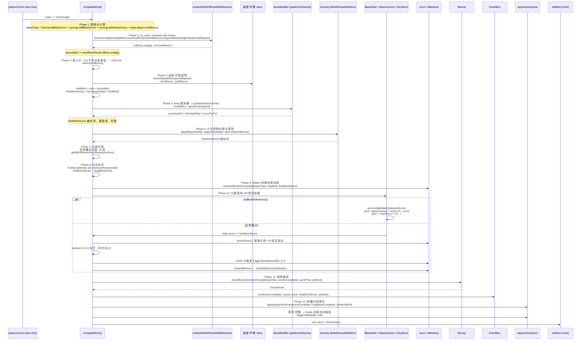

# 图 3 — 每词结算管线

> 📍 **行号基线**：`file.ts:N` 基于 git commit `1b07c96`（2026-04-13）。

> 📣 **两套管线区分（必读）**：
> - 本图的 **12 阶段**是 `completeWord()` **词级**结算管线（每词触发一次）
> - `triggerAffixSkill` 的 **6 阶段**是**键级**技能触发管线（每次正确击键触发一次）
> - 两者**不是同一层级**，不可混淆。Phase 1 的 `baseChips` 公式读取的 `synergy.*` 字段就是键级管线累积写入的结果
> - 键级 6 阶段见本文档末尾 §playerCorrect() 击键管线

**意图**：一个词从"最后一个字符被正确输入"到"分数落定 + 胜利判定"之间，生产代码 `systems/battle.ts:completeWord()`（函数体 L1001-L1374；Phase 1-12 在 L1001-L1219 内）有 12 个阶段，每个阶段都可能被遗物 / boss 修饰器 / 附魔修改。这张图按**真实调用顺序**列出所有插入点，是未来 57.7 迁移每个子系统时查表的权威来源。新功能加在哪一层、哪些 hook 必须幂等，都写明。

---

## 入口

**`completeWord()`** — `src/src/systems/battle.ts:1001`

调用时机：`playerCorrect()` 检测到 `state.player.index >= state.player.word.length` 即全部字符正确时自动调用。

进入前已发生：
- 连击已增加：`state.combo++`（`battle.ts:655`）
- 倍率已更新：`state.multiplier = baseMult + combo * comboBonus + synergy.skillMultBonus`（`battle.ts:676`）
- 技能已触发：每次 `playerCorrect()` 调用 `triggerSkill(skillId, key)` 执行 affixTrigger 6 阶段（`battle.ts:784`）
- 底分已累积：`wordBaseScore` 模块级变量 += letterBase（`battle.ts:727`）
- `synergy.skillBaseScore / letterBaseScore / skillMultBonus` 已由各次技能触发写入

## 12 阶段结算管线



## 12 阶段详细清单（实施对照）

### Phase 1 — 基础分计算
- **代码**：`battle.ts:1005`
- **公式**：`baseChips = floor(wordBaseScore + synergy.skillBaseScore + synergy.letterBaseScore + state.player.wordBonus)`
- **输入**：模块级 `wordBaseScore`、`synergy` 全局、`state.player.wordBonus`
- **可插入性**：不可，是单纯的求和
- **Godot 映射**：C# 端 `Scoring.ComputeBaseChips(synergy, wordBaseScore)` 纯函数

### Phase 2 — on_word_complete 遗物管道
- **代码**：`battle.ts:1013` `resolveRelicEffectsWithBehaviors('on_word_complete', context, callbacks)`
- **输入 context**：combo, multiplier, totalSkillCount, wordPerfect, wordResourceTypes, leftHandTriggered, rightHandTriggered, wordElapsed
- **输出**：`{ effects.multiply, 通过 onTimeRefund 回调改 state.time }`
- **可插入性**：高 — 新遗物走 `resolveRelicEffectsWithBehaviors` 管道
- **幂等性**：严格每词只调一次
- **Godot 映射**：C# 端 `RelicPipeline.ResolveOnWordComplete(ctx)` — 把各 `*RelicBehaviors.ts` 的 on_word_complete 钩子统一走管道

### Phase 3 — 爵士乐加成
- **代码**：`battle.ts:1035-1042`
- **触发条件**：一词内 ≥3 种不同词条类型
- **输出**：`bonusMult += jazzBonus`
- **Godot 映射**：随 jazz 遗物迁移到 `SkillRelicBehaviors.cs`

### Phase 4 — 速度/节奏遗物
- **代码**：`battle.ts:1043-1060`
- **触发条件**：词用时短于/长于上个词
- **输出**：`state.time += timeBonus`, `state.player.gold += goldBonus`
- **可插入性**：中 — 走 `checkSpeedRelics` 入口
- **Godot 映射**：`SpeedRelicBehaviors.cs`

### Phase 5 — Boss 修饰器封顶/衰减/税
- **代码**：`battle.ts:1061-1077`
- **输入**：`getActiveParams()` 返回当前 active modifier 的合并参数
- **三种修饰器效果**：
  - `scoreCapPct` — `finalWordScore = min(finalWordScore, getShieldedScoreCap(cap))`
  - `diminishRate` — `finalWordScore *= getDiminishMultiplier()`; `incrementDiminishCount()`
  - `scoreTaxPct` — `finalWordScore -= getShieldedValue(tax, true)`
- **注意 cap 与 tax 走 shield 过滤**：`base_shield` 遗物会减弱 cap 和 tax 的效果
- **Godot 映射**：`BossModifierEngine.ApplyPostScoreEffects(ref score)`

### Phase 6 — 计分护盾 / 雪球 / 暴击风暴
- **代码**：`battle.ts:1078-1099`（`applyBaseShield` @1078 / `applySnowball` @1084 / `getCritStormBonus` @1092）
- **三个连续应用**：
  1. `applyBaseShield(finalWordScore)` — 每词最低 20 分
  2. `applySnowball(finalWordScore)` — 每词 +5% × wordIndex
  3. `getCritStormBonus()` — 单词内 ≥2 次暴击时 × 1.5
- **注意顺序敏感**：shield 先于 snowball，snowball 先于 storm
- **Godot 映射**：`ScoringRelicBehaviors.cs` 三个独立纯函数串行

### Phase 7 — 词根共振
- **代码**：`battle.ts:1101-1111`
- **触发条件**：装备了词根共振类遗物且 `wordLen > 阈值`
- **副作用**：`state.affixSkillStates[sid].stacks += N`（全部叠层词条）
- **Godot 映射**：`StackingRelicBehaviors.cs::OnWordComplete`

### Phase 8 — 伪词反扣
- **代码**：`battle.ts:1112-1117`
- **触发条件**：`isDecoyWord() && !isDecoyRecognized()`
- **副作用**：`finalWordScore = -finalWordScore`
- **Godot 映射**：`BossModifiers.cs::HandleDecoy` — 注意这是**唯一**可能把 finalWordScore 变负的阶段

### Phase 9 — 结算动画
- **代码**：`battle.ts:1118`
- **调用**：`showSettlementComplete(baseChips, finalMult, finalWordScore)`
- **Godot 映射**：`BattleHud.cs::PlaySettlementAnimation`（视觉层，不影响数值）

### Phase 10 — 分数落地 / 黑洞吞噬
- **代码**：`battle.ts:1122-1174`
- **分支**：
  - **若 `isBlackHoleActive()`**：分数进入隐藏池，**跳过**实际的 `state.score +=`、跳过胜利检查。池得分 = `glassCannon ? score*10 : score`；`keyStorm ? *0.5 : 1`
  - **否则**：`state.score += finalWordScore`；然后：
    - **玻璃大炮** — 两阶段演出：先 bumpScore 原始值，400ms 后 setTimeout 设置到 10 倍值
    - **全键风暴** — 得分 × 0.5 同步扣分（避免绕过胜利判定）
    - ≥1000 分触发慢动作 `triggerSlowMotion(300, 0.7)`
    - `checkMilestone(prevScore, state.score)` 触发里程碑庆祝
- **Godot 映射**：这是**最复杂的阶段**。C# 端需要：
  1. `Scoring.IsBlackHoleActive` 分支
  2. `GlassCannonDelay` 用 `Tween` + `await timer` 实现延迟演出
  3. `Scoring.ApplyKeyStormPenalty` 在主分数更新后立即扣除
  4. `Milestones.Check` 同步

### Phase 11 — 猎物悬赏
- **代码**：`battle.ts:1175-1188`
- **调用**：`checkBountyOnWordComplete({combo, wordsCompleted, wordTime, perfect})`
- **副作用**：`state.gold += bountyGold`
- **Godot 映射**：`StageRelicBehaviors.cs::CheckBountyOnWordComplete`

### Phase 12 — 事件发射 + 附魔外部事件
- **代码**：`battle.ts:1189-1219`
- **顺序**：
  1. `eventBus.emit('word:complete', { word, score: finalWordScore, perfect })`
  2. 遍历所有 `affixSkills` → `applyApprenticeEvent('wordComplete', ...)` — 学徒成长
  3. 若 `word.length >= 6` → `applyApprenticeEvent('longWordComplete', ...)`
  4. 若 `state.wordPerfect` → `applyApprenticeEvent('perfectWord', ...)`
  5. 质变·觉醒：若技能装备 `QuestInnate` 附魔，对 `Innate` 词条自动 `triggerSkill(skillId, null)` N 次
- **Godot 映射**：signal 发射 + `EnchantmentGrowth.Process` + `QuestInnateAuto.Process`

### Phase 后续（非 `completeWord()` 内部）
完成后 `battle.ts` 的调用链继续：
- `setWord()` 取下一个词（若 `state.score < state.targetScore`）
- 胜利检查 → 若 `state.score >= state.targetScore` → `endLevel()` → 根据下一节点类型切到 `shop/rest/ritual` 或下一 battle → 若最后一关 → `victory()`

## 可插入点速查

| 要加什么行为 | 插在哪个 Phase | 函数/模块 |
|---|---|---|
| 遗物对整词分数的加算/乘算 | Phase 2 | 在对应 `*RelicBehaviors.ts` 的 `on_word_complete` 钩子 |
| 遗物对时间的奖励/惩罚 | Phase 2 的 `onTimeRefund` 回调；或 Phase 4（速度类） | `resolveRelicEffectsWithBehaviors` callbacks |
| boss 修饰器影响分数 | Phase 5 | `BOSS_MODIFIER_REGISTRY` 的 `apply`/`onTick`/`cleanup` |
| 计分底线保护 / 递增加成 | Phase 6 | `ScoringRelicBehaviors.ts` |
| 叠层词条"完词时"触发 | Phase 7 | `StackingRelicBehaviors.ts` |
| 新的悬赏类遗物 | Phase 11 | `StageRelicBehaviors.ts::checkBountyOnWordComplete` |
| 完词时的附魔成长 | Phase 12 | `applyApprenticeEvent` + `QUEST_ENCHANTMENT_DEFS` |
| 词语效果（`WordEffect`）整词加成 | Phase 1（底分计算前先累积）或 Phase 2（走遗物管道） | `wordEffects` Map 读取 |

## 幂等性要求

这些 hook **严格每词只能调用一次**，多次调用会导致 bug：
- `resolveRelicEffectsWithBehaviors('on_word_complete', ...)` — 遗物管道（Phase 2）
- `incrementDiminishCount()` — boss 修饰器衰减计数（Phase 5）
- `applySnowball()` — snowball 内部自增 wordIndex（Phase 6）
- `checkMilestone()` — 里程碑检测（Phase 10）
- `applyApprenticeEvent` — 学徒成长（Phase 12）

**Godot 端注意**：如果实施时拆成多 signal 并行，要确保每个 hook 的 emit 只 fire 一次；不能用 `await` 或多订阅者重复执行。

## playerCorrect() 内部的击键管线（简要，仅交叉引用）

每次正确击键在 `playerCorrect()` (line 642) 内部运行：

```
combo++ → emit('combo:update')
→ 触发绑定技能 triggerSkill(skillId, key)
  → orchestrateAffixTrigger()  (FIFO work queue)
    → triggerAffixSkill()  (6 阶段)
      → Phase 1 base 值
      → Phase 2 加算词条
      → Phase 3 乘算词条
      → Phase 4 资源路由
      → Phase 5 post-trigger (Recurse/Splash/Outcast/Charge)
      → Phase 6 邻居通知 (Resonance/Link/Apprentice/Conduit)
→ 字母底分 wordBaseScore += letterBase
→ 若绑定技能是 Charge → 暂停推进
```

这个管线和图 3 的结算管线是**两个独立层级**：前者每键触发写 `synergy`，后者每词触发读 `synergy`。Phase 1 的 `baseChips` 公式中 `synergy.skillBaseScore` 就是击键时 affixTrigger 累积的结果。

## Notes（发现但不修）

- **`bonusMult` 变量只在 Phase 2/3 被加算**，然后一次性乘入 `finalMult`。这意味着 Phase 4 的速度遗物**不影响** `finalMult`（它们直接改 `state.time` / `state.player.gold`），这个边界容易被新手误解。
- **Phase 10 黑洞分支**跳过胜利检查，但不跳过 Phase 11/12。也就是说黑洞期间仍然会发 `word:complete` 事件、仍然会触发悬赏和附魔成长。迁移时注意不要把这些塞进黑洞分支内。
- **Phase 12 的 `applyApprenticeEvent('wordComplete')` 对所有 affixSkills 都调用一遍**，即使该技能本次没有触发。这可能是期望行为（"完词时全局成长"），但值得在 Godot 端明确文档化。

## 相关文档

- [README.md](README.md) — 索引
- [01-battle-state-machine.md](01-battle-state-machine.md) — 本管线所在的 `WordComplete` 状态
- [02-event-bus.md](02-event-bus.md) — Phase 12 发射的 `word:complete` signal
- [04-save-schema.md](04-save-schema.md) — `synergy` / `state.resources` / `state.battleStats` 等字段
