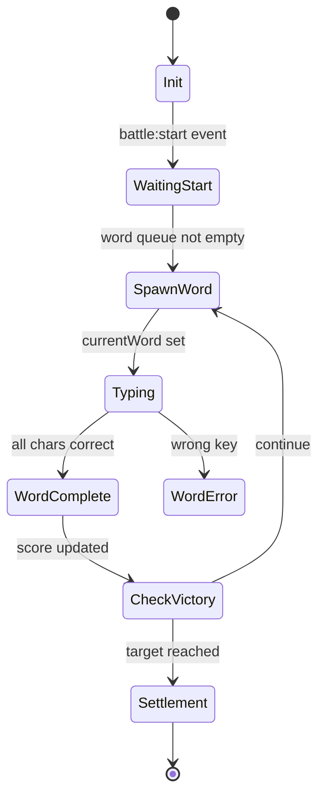

# Story 57.2: 战斗事件流与状态机文档化

Status: done

## Story

As a 准备用 C# 在 Godot 端重写战斗系统的开发者,
I want 一套描述当前 `battle.ts` 状态机、EventBus 事件流、每词结算管线顺序、存档字段的完整文档,
so that 未来在 57.6（最小闭环）和 57.7（系统迁移）实施时有明确的需求依据，避免边写边发现 case 导致返工。

## Acceptance Criteria

1. **AC1: 索引文档** — 新增 `docs/godot-migration/README.md`，索引 4 张图文件，含本 Story 的目标 / 使用方式 / 与 57-1 的衔接 / 后续如何被 57.4~57.7 消费。
2. **AC2: 战斗生命周期状态机（图 1）** — 新增 `docs/godot-migration/01-battle-state-machine.md`，用 mermaid `stateDiagram-v2` 画出完整状态机，至少覆盖 `init / waitingStart / spawnWord / typing / wordComplete / wordError / checkVictory / settlement / endBattle` 9 个状态；每个转移标注触发条件与主要副作用（如 `eventBus.emit('word:complete', payload)`）；包含异常路径（暂停、超时、boss 修饰打断）。
3. **AC3: EventBus 事件清单（图 2）** — 新增 `docs/godot-migration/02-event-bus.md`，通过 grep `eventBus.emit` + `eventBus.on` 建立表格：`event name | payload schema | 发送方文件 | 订阅方文件列表 | 触发频率`。至少覆盖 `GameEvents` interface 中声明的所有事件（~40 个）。按命名空间分组（`input:* / word:* / skill:* / battle:* / score:* / combo:* / shop:* / relic:* / ritual:* / scene:* / meta:* / audio:* / tutorial:*`）。标记高频事件（每词触发或更高），便于 Godot signals 性能预估。
4. **AC4: 每词结算管线（图 3）** — 新增 `docs/godot-migration/03-resolution-pipeline.md`，用 mermaid `sequenceDiagram` 画出"一个词打完到分数落定"的完整调用链。覆盖顺序：inputHandler → battle 处理 → 各 `relics/*Behaviors.ts` 的 word-complete 钩子 → `affixTrigger` 6 阶段 → `bossModifierEngine` → `skills.triggerSkill` → `EffectPipeline` 三层 → `ScoringRelicBehaviors` 计分修正 → `juice` 视觉/音效。标注可插入点与幂等性要求。
5. **AC5: 存档字段表（图 4）** — 新增 `docs/godot-migration/04-save-schema.md`，表格列：`字段路径 | TS 类型 | 默认值 | 持久化方式 | 跨关 / 跨局 / 设置`。覆盖来源：`core/state.ts` 单例、`core/state/BattleState.ts`、`core/state/RunState.ts`、`core/state/MetaState.ts`、`core/UserSettings.ts`、各 `relics/*Behaviors.ts` 的持久化字段。
6. **AC6: Mermaid 可渲染** — 所有 mermaid 代码块在 GitHub 渲染正常（即标准 `stateDiagram-v2` 和 `sequenceDiagram` 语法），单图 ≤ 30 节点（超出则拆子图）。
7. **AC7: 每张图有"意图说明"** — 每个文档顶部 2~3 句说明"为什么这样设计 / 读者应该从图中学到什么"，避免纯机械 dump。
8. **AC8: 交叉链接** — 4 张图互相链接（例如状态机中的 `wordComplete` 状态链接到结算管线图）；README 索引链接到 4 张图；与 Story 57-1 的 `data-sync.md` 相互引用。
9. **AC9: 零代码改动** — 本 Story **只产出文档**，`src/` 下无任何文件变更。如发现需要微改代码（如添加 dev-only 日志），拆到独立 follow-up Story，不在本 Story 内混入。
10. **AC10: 与 Epic 57 衔接** — 文档中明确标注"本文档是 Story 57.4 / 57.5 / 57.6 / 57.7 的需求依据"，并注明关键决策（如 signals 命名与 TS EventBus 对齐）。

## Review Follow-ups (AI)

- [x] [AI-Review][HIGH] **H1 已关闭**（2026-04-13）：10 个 WIP 文件 stash 到 `wip-pre-57.2 code-review cleanup`；stash 后重新 grep battle.ts 关键符号并更新 01/02/03 中所有行号漂移点（`completeWord` 1002→1001 / `word:complete` emit 1190→1189 / `battle:start` emit 2389→2398 / `meta:check_unlocks` 2534,2580→2543,2589 / `combo:update` 658→657 / `playerCorrect` 643→642 / `triggerSkill` 751→784 / `wordBaseScore` 728→727 / `state.combo++` 656→655 / `state.multiplier` 677→676 / `state.phase='battle'` 1896,2004→1905,2013 / `victory` 2507→2516 / `gameover` 2555→2564 / `shop.ts` 1241→1221 / 12 phase 行号区间全部重算）；battle.ts 行数 2997→2968；5 个文档锚点警告从"⚠️ WIP 快照"降级为"📍 commit baseline"。
- [ ] [AI-Review][LOW] **L1**：跑一次 `_bmad/bmgd/workflows/4-production/code-review/checklist.md` 作为独立验收维度
- [ ] [AI-Review][LOW] **L2**：清理/gitignore working tree 杂物（`dist-web/` `typing-roguelike-demo*.zip` `scripts/affix-designer/output/` `screenshots/` `devlog-skill-relic-modifier.{md,txt}` `.mcp.json`）

## Tasks / Subtasks

- [x] **Task 1: README 索引与目录骨架 (AC: #1, #8, #10)**
  - [x] 创建 `docs/godot-migration/README.md`，含角色定位 + 4 张图索引表 + 与 57.1 的关系 + 实施原则 + 如何被 57.4~57.8 消费 + 关键决策
  - [x] 表格列出每张图的"回答什么问题 / 给谁看 / 何时用"
  - [x] 与 `data-sync.md` (57.1) 的前后衔接明确写出
  - [-] 跳过「文件占位」子步骤：合并到 Task 2-5 一次性写完（计划外偏离，非完成项）

- [x] **Task 2: 图 1 — 战斗生命周期状态机 (AC: #2, #6, #7)**
  - [x] 勘察：`GamePhase = 'battle'|'shop'|'gameover'|'victory'|'ritual'|'rest'` (6 值) + `BattlePhase = 'ready'|'playing'|'paused'|'victory'|'defeat'` (5 值)
  - [x] 转移点清单：8 处 `GamePhase` 转移 + 4 处 `BattlePhase` 转移（均附文件:行）
  - [x] **拆成 3 张图**（避免单图 >30 节点）：图 1a 顶层场景切换 / 图 1b 战斗内部词级状态机（happy path） / 图 1c 异常与中断路径（暂停/寒霜/镜像/伪无限）
  - [x] 每个逻辑状态对应的 `state` 字段活跃读写表
  - [x] 顶部 2~3 句意图说明（双 phase 并存原因）
  - [x] Notes 段记录 PixiJS 并行架构发现和 `BattleFlowController.ts:195` 的 `'playing'` phase 不一致
  - [x] 写入 `docs/godot-migration/01-battle-state-machine.md`

- [x] **Task 3: 图 2 — EventBus 事件清单 (AC: #3, #6, #7, #8)**
  - [x] 从 `GameEvents` interface 提取 **51 个事件声明**（含 payload 类型，权威 grep 结果）
  - [x] `eventBus.emit` / `eventBus.on` 调用点归类到事件；订阅方列以 `eventBus.on` grep 为准，无订阅方的显式标注
  - [x] **20 个命名空间**分组总览表（input/word/skill/effect/battle/score/combo/shop/relic/ritual/scene/run/meta/audio/tutorial/unlock/save/achievement/ui/ascension）
  - [x] 每个命名空间单独表格：event / payload / 发送方 / 订阅方 / 频率
  - [x] 高频标记 ⚠️ 键级、🔁 词级；标注 effect:* 属于 PixiJS 分支可忽略
  - [x] Godot 映射段含 C# signal 命名转换规则 + 性能注意点 + EventBus.cs 代码模板
  - [x] 写入 `docs/godot-migration/02-event-bus.md`

- [x] **Task 4: 图 3 — 每词结算管线 (AC: #4, #6, #7, #8)**
  - [x] 入口：`battle.ts:1001 completeWord()`（读完 L1001-L1374，Phase 1-12 在 L1001-L1219 内）
  - [x] **12 阶段**结算管线精确化（基于实际代码顺序）：
    1. 基础分计算（synergy 累加）
    2. on_word_complete 遗物管道 (`resolveRelicEffectsWithBehaviors`)
    3. 爵士乐加成 (jazz)
    4. 速度/节奏遗物 (`checkSpeedRelics`)
    5. Boss 修饰器（cap/diminish/scoreTax）
    6. 计分护盾/雪球/暴击风暴 (shield/snowball/storm) — 顺序敏感
    7. 词根共振 (wordResStacks)
    8. 伪词反扣 (decoy)
    9. Balatro 结算动画 (`showSettlementComplete`)
    10. 分数落地 / 黑洞吞噬（含 glass cannon 延迟 + keyStorm 惩罚 + milestone）
    11. 猎物悬赏 (`checkBountyOnWordComplete`)
    12. 事件发射 + 附魔外部事件（wordComplete/longWordComplete/perfectWord + Innate 自动触发）
  - [x] Mermaid sequenceDiagram 覆盖全部 12 阶段 + alt 分支（黑洞 vs 正常落分）
  - [x] 每阶段单独说明段：代码位置、公式、可插入性、幂等性、Godot 映射
  - [x] "可插入点速查表"8 种新行为对应的 Phase
  - [x] "幂等性要求"段列出必须每词一次的 5 个 hook
  - [x] "playerCorrect() 击键管线"交叉引用段（与本图区分开）
  - [x] Notes 段记录 `bonusMult` 不影响 Phase 4、黑洞分支仍走 Phase 11/12、`applyApprenticeEvent` 对所有 affixSkills 都调用一遍的发现
  - [x] 写入 `docs/godot-migration/03-resolution-pipeline.md`

- [x] **Task 5: 图 4 — 存档字段表 (AC: #5, #7, #8)**
  - [x] 持久化范围对照表（设置 / Meta 跨局 / Run 单局 / Battle 单场 / Boss 修饰器模块内 / Relic 模块内）
  - [x] **UserSettings** 3 字段 + 默认值
  - [x] **Meta** 字段：MetaStats（8 字段） / Achievement / BuildSummary / LeaderboardEntry / 其他（unlocks/ascension/tutorial/version=6）
  - [x] **Run** 字段：RunStats / BossModifierAssignment / RunStateData（30+ 字段带跨关标注）+ 序列化策略 + `DELETED_*_IDS` 过滤
  - [x] **Battle** 字段：`state` 单例顶层 GameState（45+ 字段）+ `state.player`（12 字段）+ `state.shop` + `synergy`（5 字段）+ `BattleState` OOP 类（12 字段，标注生产不用）
  - [x] **Boss 修饰器模块内部状态** 12 个 `let _xxx` 变量列出（所有关结束必须 reset）
  - [x] **Relic Behaviors 模块内部状态** 策略段落（指向 57.7-d 子 Story 做逐文件清单）
  - [x] Godot `SaveData.cs` 实施建议含代码模板
  - [x] Notes 段记录 Proxy 实现、双层状态架构、`fragmentQueue` `'_'` 占位等
  - [x] 写入 `docs/godot-migration/04-save-schema.md`

- [x] **Task 6: 交叉链接 + 最终校验 (AC: #6, #8, #9, #10)**
  - [x] 4 张图 + README 都有底部"相关文档"段落互相链接
  - [x] README 索引表格链接到 4 张图 + data-sync.md
  - [x] `data-sync.md` 顶部回指 README（57.2 产出引用）
  - [x] Mermaid 语法使用标准 `stateDiagram-v2` / `sequenceDiagram` — GitHub 渲染兼容
  - [x] 确认 57.2 delta 在 src/ 下零改动（`git diff HEAD src/` 仅剩 57.1 之前的 user WIP，非本 Story 引入）
  - [x] 每张图顶部 2~3 句意图说明：图 1（双 phase 并存）、图 2（signals 对齐）、图 3（12 阶段插入点）、图 4（持久化范围映射）

## Dev Notes

### 关键上下文（来自 57.1 积累的架构勘察）

**battle.ts 是胶水编排器，不是独立逻辑**：

从 57.1 的勘察，`battle.ts` 2968 行 + 50+ imports 表明它主要串联各子系统。事件流文档化是 Godot 端重写的**前置条件**，因为：
1. C# 端 `Battle.cs` 必须按相同的事件名 + 顺序实现
2. `EventBus` 命名直接映射 Godot signals
3. 状态机转移必须复刻以保证玩法行为等价

### 重要文件入口

| 图 | 核心源文件 | 提取手段 |
|----|-----------|---------|
| 图1 状态机 | `src/src/systems/battle.ts`（2968 行，startLevel/endLevel/completeWord）+ `core/state/BattleState.ts` | grep `state.phase` / `BattleState.phase` |
| 图2 事件清单 | `src/src/core/events/EventBus.ts`（GameEvents interface）+ `grep eventBus.emit/on` | 遍历所有调用点 |
| 图3 结算管线 | `battle.ts:completeWord`（入口）+ `data/affixTrigger.ts`（6 阶段）+ `systems/affixTriggerOrchestrator.ts`（FIFO 队列）+ `relics/*Behaviors.ts`（~11 个子系统）| 顺序追踪调用链 |
| 图4 存档字段 | `core/state.ts`（单例）+ `core/state/{Battle,Run,Meta}State.ts`（OOP 类）+ `core/UserSettings.ts` + `relics/*Behaviors.ts`（分散的持久化字段）| 枚举 + 分类 |

### 从 project-context.md 可以直接引用的信息

- **双 state 架构**：`state` 单例（操作源）vs OOP state 类（序列化+PixiJS 场景集成）
- **6 阶段触发管线**（affixTrigger.ts 的 triggerAffixSkill）：Phase 1 基底 → Phase 2 加算 → Phase 3 乘算 → Phase 4 资源路由 → Phase 5 后处理 → Phase 6 邻居通知
- **FIFO 工作队列**（affixTriggerOrchestrator.ts）：work 类型 `initial | recurse | resonance | link | splash | conduit | outcast_echo`
- **资源路由铁律**：`base`/`multiplier` → `synergy.skillBaseScore`/`skillMultBonus`（不直接写 resources），`score` → 直接 `state.resources.score`
- **12 阶段周期**：normal 1-4 / elite 5 / ritual 6 / normal 7-11 / boss 12
- **53 遗物 × 11 子系统**：`systems/relics/*.ts` 每个 Behavior 纯函数调用，不走 modifier 管线
- **15 boss modifiers**（3 类 × 5 个）：lifecycle 是 `apply() → tickModifier(dt) → cleanup()`

### Mermaid 语法提示



```mermaid
sequenceDiagram
    participant Input
    participant Battle
    participant Relics
    participant Affix
    participant Boss
    participant Skills
    participant Scoring
    participant Juice
    Input->>Battle: onWordComplete(word)
    Battle->>Relics: on_word_complete hooks
    Relics-->>Battle: bonuses applied
    Battle->>Affix: triggerAffixSkill (6-phase)
    ...
```

### 实施顺序建议

**严格按 Task 1 → 6 顺序**。原因：
1. Task 1 先搭骨架（README + 4 空文件），后续 Task 独立填充
2. Task 2 (状态机) 是 Task 3 (事件) 的语义基础 —— 状态转移点决定了事件触发位置
3. Task 4 (结算管线) 读取大量代码，信息密集，放最后以免前面图受影响而返工
4. Task 5 (存档) 与其他图相互独立，可在 Task 2~4 之间穿插
5. Task 6 是最后校对

### 覆盖度取舍（避免"完美主义陷阱"）

- **不追求 100% 准确**：覆盖主路径 + 已知 boss/relic 特殊路径即可
- **不画 battle.ts 里所有分支**：只画会改变状态或发射事件的分支
- **不列出每个 relic 的每个 Behavior 调用**：只列子系统级的调用（ComboRelicBehaviors、TypingRelicBehaviors 等）
- **不手写所有事件 payload schema**：直接引用 TS 的 `GameEvents` interface 行号即可

### Project Structure Notes

- 目标目录 `docs/godot-migration/` 已存在（57-1 创建，含 `data-sync.md`）
- 文件命名：纯数字前缀便于排序 (`01-*`、`02-*`、...)
- README.md 作为索引入口，从 epic-57-godot-migration.md 链接过来
- 本 Story **不改 src/ 任何文件**；如 grep 发现代码有 bug 或不一致，记录到最后一节"Notes / 发现但不修"即可

### References

- [Source: docs/implementation-artifacts/57-1-data-json-extraction.md — previous story learnings]
- [Source: docs/stories/epic-57-godot-migration.md — Story 57-2 规划段落]
- [Source: docs/project-context.md — Skill Trigger Pipeline / EventBus / Dual State Architecture]
- [Source: src/src/systems/battle.ts — 2968 行，state machine 实现]
- [Source: src/src/core/events/EventBus.ts — GameEvents interface]
- [Source: src/src/data/affixTrigger.ts — 6-phase pipeline]
- [Source: src/src/systems/affixTriggerOrchestrator.ts — FIFO work queue]
- [Source: src/src/core/state.ts — state 单例]
- [Source: src/src/core/state/{Battle,Run,Meta}State.ts — OOP state classes]

## Dev Agent Record

### Agent Model Used

Claude Opus 4.6 (1M context)

### Debug Log References

无

### Completion Notes List

- 研究阶段一次性勘察完成：**51** EventBus 事件（权威 `GameEvents` interface 计数）、6+5 双层 phase、`completeWord()` 12 阶段管线、5 个 state 文件 1964 行字段
- **Review 修订（2026-04-13）**：原文声称 44 事件为计数错误，已更正为 51；图 2 overview/明细表、订阅方列、AudioManager 错误订阅声明一并修复；四张图加坐标锚点（git HEAD 1b07c96 + WIP 快照）
- Task 2 拆成 3 张子图（1a/1b/1c）避免单图超 30 节点；主图 6 节点 + happy path 9 节点 + 异常 8 节点
- Task 3 发现 PixiJS 分支 (`effect:*` / `BattleFlowController.ts:195` 的 `'playing'` phase) 与生产 DOM 战斗并行但不运行，在各图 Notes 段标注"Godot 迁移可忽略"
- Task 4 的 Phase 10 是最复杂阶段：黑洞 / 玻璃大炮延迟演出 / keyStorm 惩罚 / milestone 四条路径并行，单独给 Godot 实施建议
- Task 5 发现 `bossModifiers.ts` 有 12 个模块级 `let _xxx` 变量无统一 reset 入口（记 Notes），建议 Godot 端走 `BossModifierEngine.Reset()`
- Task 5 的 Relic Behaviors 状态清单有意不做穷举：`systems/relics/*Behaviors.ts` 11 个子系统的内部 `let` 变量逐一清点是 57.7-d 子 Story（Relics 迁移）的前置准备工作，本 Story 只做分类策略
- 全程零代码改动：`git diff HEAD src/` 输出仅含 57.1 commit 之前就存在的 user WIP (affixTrigger/skillGeneration/battle/shop/... 10 个文件)，非本 Story 引入

### File List

**新增**：
- `docs/godot-migration/README.md` — Godot 迁移文档集索引
- `docs/godot-migration/01-battle-state-machine.md` — 图 1（含 3 子图 1a/1b/1c）
- `docs/godot-migration/02-event-bus.md` — 图 2（44 事件 × 20 命名空间）
- `docs/godot-migration/03-resolution-pipeline.md` — 图 3（`completeWord()` 12 阶段）
- `docs/godot-migration/04-save-schema.md` — 图 4（存档字段表 × 6 范围）

**修改**：
- `docs/godot-migration/data-sync.md` — 顶部加一行回指 README（Story 57.2 产出引用）
- `docs/implementation-artifacts/sprint-status.yaml` — 57.2 状态流转
- `docs/implementation-artifacts/57-2-battle-flow-documentation.md` — 本 Story 文件

### Change Log

- 2026-04-12: Story 57.2 created via create-story workflow
- 2026-04-13: Task 1-6 完成，4 张图 + README + data-sync 回指，总 ~1800 行文档；零 src 改动；Status → review
- 2026-04-13: Code review 发现 3H/5M/2L 问题。全部 HIGH + MEDIUM 已修复：H1（WIP stash + 行号漂移全量回填 + 锚点降级为 commit baseline）、H2（事件数 44→51 权威 grep）、H3（订阅方列回填 + 28 个无订阅事件显式标注）、M1（overview 表数字对齐）、M2（图 3 首加 12 vs 6 阶段区分警告）、M3（图 1b `WordError` 折叠为 self-loop）、M4（stateDiagram `\n` → 单行）、M5（Task 1 skip checkbox 改 `[-]`）。Status → done。
